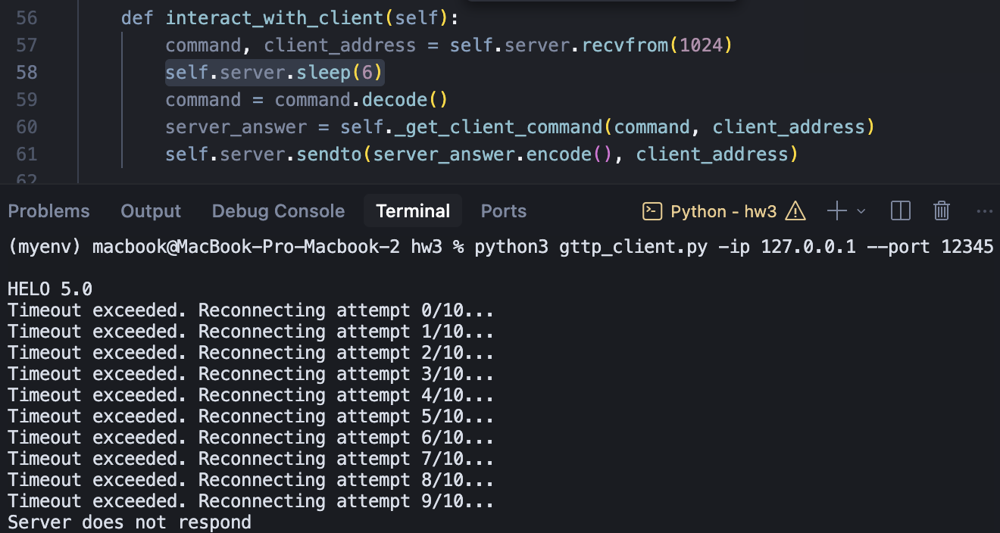
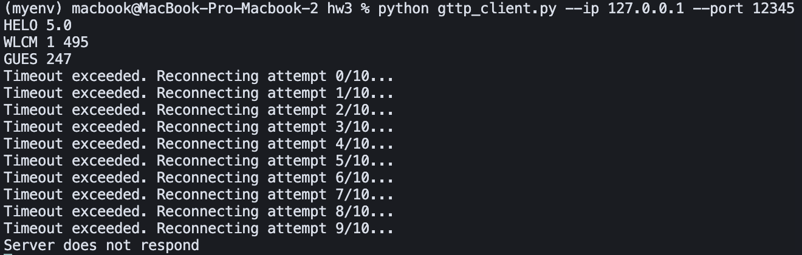
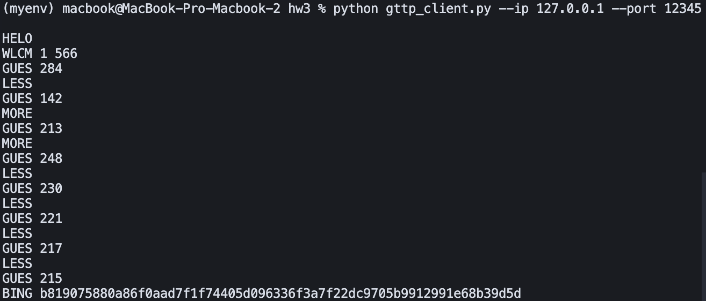

## Task 2

В общем все по заданию.

### [`gttp_server.py`](./gttp_server.py)

**Входные параметры:**
*   `--ip` (`-ip`): IP
*   `--port` (`-p`): server port

### [`gttp_client.py`](./gttp_client.py)
*   `--ip` (`-ip`): IP
*   `--port` (`-p`): server port

Единственное что не добавила timeout на сервер, потому что как-то странно, если клиент будет думать "какое бы число мне написать" а сервер раз в 5 секунд будет ему спамить.

Но на клиента добавила timeout, задаем с `HELO 5.0`. 

**timeout работает**
Чтобы проверить и показать, что оно работает, смотри скрин ниже (поставила server.sleep перед ответом клиенту)

**а бывает такое, что timepout действительно происходит (без sleep)**

**пример выигрыша**

**пример проигрыша**

